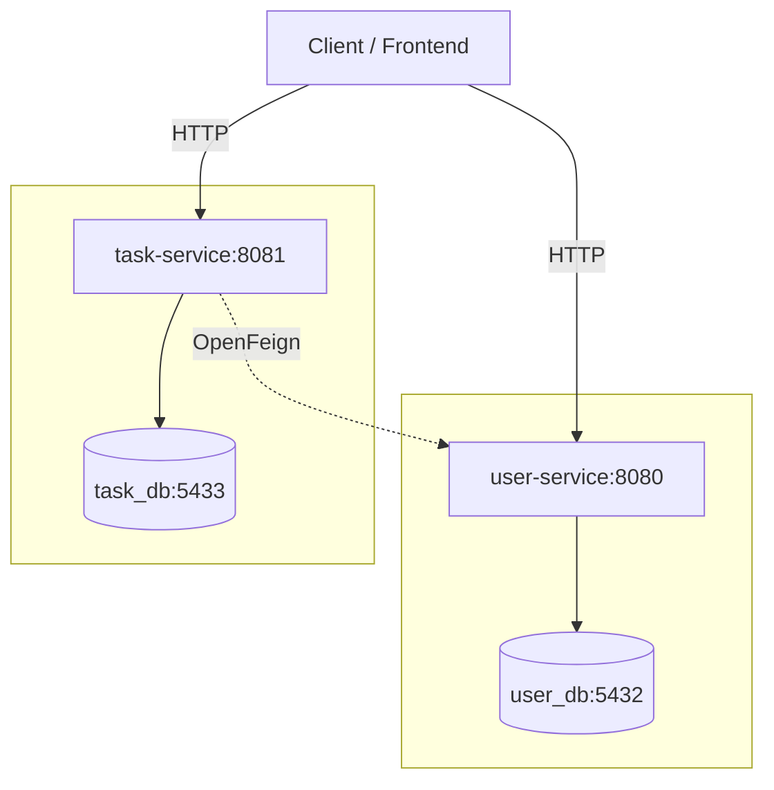

**Task Manager** - это распределенная система управления задачами, построенная на микросервисной архитектуре. Проект
демонстрирует реализацию взаимодействия между независимыми сервисами, изоляцию данных и принципы построения RESTful API.

Система состоит из двух автономных сервисов, каждый из которых имеет собственную базу данных и общается с другим
посредством межсервисного взаимодействия.

---

1. [Архитектура](#1-архитектура)
2. [Технологический стек](#2-технологический-стек)
3. [Запуск проекта](#3-запуск-проекта)
4. [Описание API](#4-api)
5. [Конфигурация](#5-конфигурация)

---

### 1. Архитектура

Система состоит из двух автономных микросервисов. Каждый сервис владеет собственной базой данных. Взаимодействие при
валидации данных осуществляется через HTTP-клиент (Feign).



`user-service`: Отвечает за регистрацию и управление пользователями. Владеет базой данных `user_db`.

`task-service`: Отвечает за жизненный цикл задач. Владеет базой данных `task_db`. При назначении исполнителя обращается
к `user-service` для проверки существования `UUID` пользователя.

---

### 2. Технологический стек

**Core & Infrastructure:**

- Java 21
- Virtual Threads (Project Loom)
- Spring Boot 3
- Docker & Docker Compose

**Data:**

- PostgreSQL 17
- Spring Data JPA
- Flyway

**Communications & API:**

- Spring Cloud OpenFeign
- RFC 7807 (Problem Details)
- SpringDoc OpenAPI
- MapStruct

---

### 3. Запуск проекта

Для запуска требуется установленный Docker.

1. Клонирование репозитория:
   ```bash
   git clone https://github.com/dfnabiullin/task-manager
   cd task-manager
   ```

2. Сборка и запуск контейнеров:
   ```bash
   docker-compose up -d --build
   ```

3. (Опционально) Запуск тестов:
   ```bash
   ./gradlew test
   ```

После запуска сервисы и базы данных будут доступны по следующим адресам:

- `user-service`: http://localhost:8080
- `user_db`: localhost:5432
- `task-service`: http://localhost:8081
- `task_db`: localhost:5433

---

### 4. API

Проект использует Swagger UI для интерактивной документации. После запуска приложения документация доступна по ссылкам:

[User Service API](http://localhost:8080/swagger-ui/index.html)

[Task Service API](http://localhost:8081/swagger-ui/index.html)

---

### 5. Конфигурация

Параметры подключения к базам данных и адреса сервисов вынесены в переменные окружения (`docker-compose.yml`):

- `SPRING_DATASOURCE_URL`: JDBC URL для подключения к базе данных.

- `APPLICATION_CONFIG_USER_URL`: URL, по которому `task-service` обращается к `user-service`.